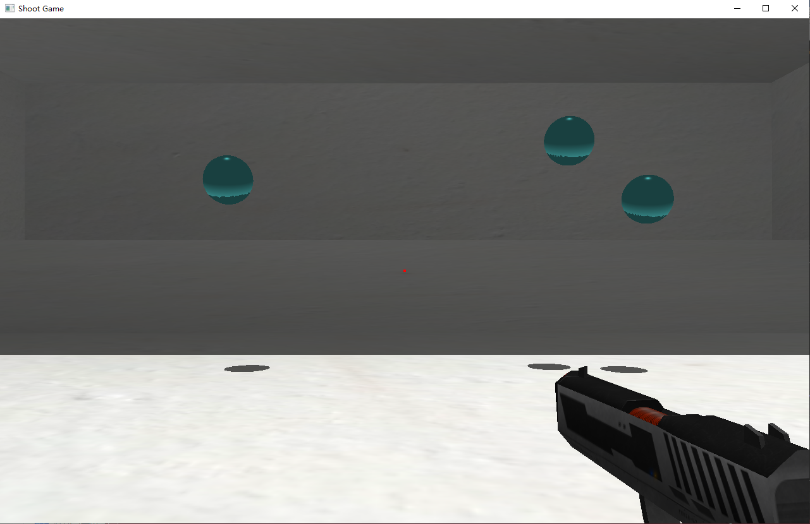

# Shoot Game

## 预览

通过根目录下exe文件可以直接打开

或是通过以下网址观看视频预览：

[OpenGL简易射击游戏_哔哩哔哩_bilibili](https://www.bilibili.com/video/BV1ca411Q7rF?vd_source=00267fad6fd11d2bde4476aea0c8689d)

## 使用方法

代码环境：Windows10，Visual Studio2022

1. 下载代码，打开sln文件
2. 将library中的include文件夹添加至附加包含目录
3. 将library中的lib文件夹添加至附加库目录
4. 运行代码
